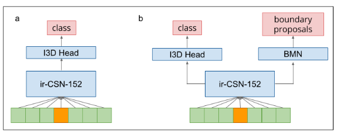

## Generic Event Boundary Detection: submission to LOVEU Challenge 2021

### Introduction

This repo is a top 3 submission to Track 1 of [LOVEU Challenge 2021](https://sites.google.com/view/loveucvpr21/home).

LOVEU Challenge aims to detect generic, taxonomy-free event boundaries that segment a whole video into chunks. Details can be found in the paper: https://arxiv.org/abs/2101.10511.

Track 1 has two sub-tracks according to different scenarios. In sub-track 1.1, there is no constraint of additional supervision for training upstream models and additional training video data. In sub-track 1.2, using additional supervision for training upstream models or additional training video data is prohibited. Thus, our solution in sub-track 1.1 includes an additional supervision human-object detector, a C3D classifier and a temporal detection networks. We remove the additional supervision in track 1.2 solution.




Fig.1: The framework of our track 1.2 approach. a) The basic 3D classification networks. ir-CSN-152 is used as backbone to extract C3D features, then a I3D classifier to classify class of boundary. Temporal stride is used. b) The boundary detection networks. BMN as an another head on the basic 3D classifier can output boundary proposals. CSN and BMN details are follows as [1][2]. Besides basic BMN structure, we leverage channel-aware attention and position-aware attention to aggregate rich context and proposal-proposal relation information.

Structure if this repo:

```
./
| data_preprocess (scripts of data preprocessing)
| evaluation (evaluation code)
| Track1.1
| Track1.2
|  |--configs/recognition/csn (configuration files of training and testing)
|  |--data (pretrain models, workdirs, val/test results)
|  |  |--models (pretrain models; CSN pretrained model can be found in MMAction2 toolbox)
|  |  |--output (training and testing workdir)
|  |--mmaction (mmaction code)
|  |--tools (training and testing code)
|  |--inference (inference code)
```

- `data_preprocessing`

  Generate train/val data in different durations and frame rates.

  ```shell
  # Generate ffmpeg cmds and annotations with 3 clip durations and 2 frame rates.
  loveu_parser_1.5s_24fps_train.py
  loveu_parser_1.5s_24fps_val.py
  loveu_parser_1s_30fps_train.py
  loveu_parser_1s_30fps_val.py
  loveu_parser_2s_30fps_train.py
  loveu_parser_2s_30fps_val.py
  
  # Generate train/val data by ffmpeg cmds in multiprocess
  generate_train_1.py
  generate_val_1.py
  generate_train_2.py
  generate_val_2.py
  ...
  
  # Map 4 boundary classes (EventChange,ShotChangeImmediateTimestamp, ShotChangeGradualRange and negative) to 2 boundary classes (boundary and negative)
  clsnum_convert.py
  
  # Vlidationn check
  video_valid_check.py
  ```

- `Track1.2/configs/recognition/csn`

  All configs we used are keeping under this dir. Learn more details of configs in [MMAction2](https://github.com/open-mmlab/mmaction2/blob/master/docs/tutorials/1_config.md).

  Usage:

  ```shell
  # ./tools/dist_train.sh [config file] [NUM of GPU] --work-dir [workdir]
  # training C3D classifier
  ./tools/dist_train.sh configs/recognition/csn/csn_loveu2_2s_30fps_train.py 6 --work-dir ./data/output/csn_4cls_2s_32f_30fps --seed 2021
  
  # training temporal detection networks
  ./tools/dist_train.sh configs/recognition/csn/csn_bmn_2s_32f.py 6 --work-dir ./data/output/csn_bmn_4cls_2s_32f_30fps --seed 2021
  ```

- `Track1.2/inference`

  ```shell
  # inference; a window will slide on a testing video by a specific stride to sample data; testing data can be split into mutiple pieces for saving time
  long_video_demo_extractor_bmn.py # inference code of temporal detection networks
  long_video_demo_extractor_c3d.py # inference code of C3D classifier
  
  # usage
  # python ./evaluation/long_video_demo_extractor_c3d.py [config file] [workdir] --half [No. of piece] --fps [frame rate] --modelname [model name] --stride [stride]
  python ./evaluation/long_video_demo_extractor_c3d.py Track1.2/configs/recognition/csn/csn_loveu4_infer.py work_dirs/loveu_4cls_1500ms_csn/epoch_20.pth --device cuda:0 --half 0 --fps 24.0 --modelname csn_4cls_1.5s_2st_24fps --stride 2
  ```

- `evaluation`

  ```shell
  # generate results by C3D classifier or temporal detection networks for evaluate
  generate_results_val.py
  generate_results_test.py
  # evaluate
  evaluate_predicts.py
  ```

### Acknowledgements

This code is based on

- [MMAction2](https://github.com/open-mmlab/mmaction2)
- [AlphAction](https://github.com/MVIG-SJTU/AlphAction)